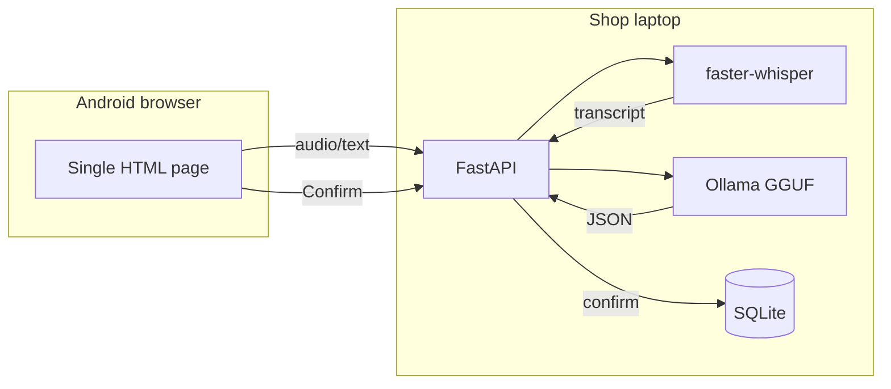

# Udhaar — voice-first khata for kirana shops

Open-weight, locally runnable credit ledger for neighbourhood shopkeepers. Speak an entry in Hindi/Marathi/Hinglish, **confirm** the parsed JSON, track balances, generate polite WhatsApp reminder links (manual send only).

## Quick start

**Demo without mic/GPU (heuristic parser):**

```bash
python3 -m venv .venv && source .venv/bin/activate
pip install -r requirements.txt
PYTHONPATH=. UDHAAR_MOCK=1 uvicorn app.main:app --host 0.0.0.0 --port 8000
# Phone/laptop: http://127.0.0.1:8000
PYTHONPATH=. python scripts/seed_demo.py   # optional fake data
```

**Full stack (Docker mock):**

```bash
docker compose up udhaar-mock --build
```

**With local LLM + Whisper:**

```bash
docker compose --profile llm up --build
docker exec -it <ollama-container> ollama pull qwen2.5:3b-instruct
# Set UDHAAR_MOCK=0 on udhaar service
pip install -r requirements-ml.txt
```

## Architecture



## Dataset (Phase 1)

```bash
PYTHONPATH=. python data/generate.py   # 4k train / 300 val / 400 test
PYTHONPATH=. pytest tests/ -q
```

Real-audio honest eval: `data/real_test/README.md`.

## Evaluation

```bash
PYTHONPATH=. python eval/run_eval.py --all
cat eval/RESULTS.md
```

Includes heuristic baseline always; Ollama base model when `ollama serve` is running. Fine-tuned row after `train/tinker_train.py` + Ollama import.

## Fine-tuning (Tinker)

See [train/README.md](train/README.md). Requires `TINKER_API_KEY`. Fallback: Unsloth/Colab documented there — do not fabricate metrics; re-run eval.

## API

| Method | Path | Description |
|--------|------|-------------|
| GET | `/health` | Status, mock flag |
| POST | `/entry/parse` | Text → proposed label |
| POST | `/entry/parse-audio` | Audio → transcript + label |
| POST | `/entry/confirm` | Save after user confirm |
| GET | `/customers` | Balances |
| GET | `/reminders` | WhatsApp links (no auto-send) |
| GET | `/summary` | Monthly saara hisaab |

## Limitations

- Heuristic/mock mode is for demo/tests — production path uses Ollama + optional LoRA.
- Customer name extraction from messy ASR remains the weakest field (see eval table).
- Real shop audio eval is **TODO(me)** until `data/real_test/labels.csv` is filled.
- Tinker → GGUF export may require manual steps; see `train/README.md`.

## Hacktoberfest / DEV post

Draft: [POST_DRAFT.md](POST_DRAFT.md)

## License

MIT
